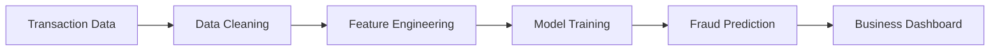

<div align="center">

# 🛡️ TRUSTSHIELD AI

### Intelligent Financial Fraud Detection & Risk Scoring Platform

*An end-to-end machine learning system that detects fraudulent financial transactions using anomaly detection, predictive modeling, and explainable AI. Designed to help financial institutions identify suspicious activity, reduce fraud losses, and improve transaction security.*


</div>

---

# 📖 Overview

Financial fraud continues to be one of the biggest challenges for banks, fintech companies, and digital payment platforms. Detecting fraudulent transactions quickly is essential for minimizing financial losses and protecting customer trust.

FraudShield AI is an intelligent fraud detection platform that analyzes transactional behavior, identifies anomalous activities, predicts fraud probability, and provides explainable insights through machine learning models and interactive visualizations.

The project demonstrates an end-to-end fraud analytics workflow—from data preprocessing and feature engineering to model training, anomaly detection, and business intelligence reporting.

---

# ✨ Core Features

## 💳 Fraud Detection

- Transaction Risk Analysis
- Fraud Probability Prediction
- Suspicious Activity Detection
- Real-Time Risk Scoring
- High-Risk Transaction Flagging

---

## 🤖 Machine Learning

Models can include:

- Random Forest
- XGBoost
- LightGBM
- Isolation Forest
- Logistic Regression
- Decision Trees

---

## 📊 Exploratory Data Analysis

Analyze transaction patterns including:

- Fraud Distribution
- Transaction Volume
- Feature Correlation
- Customer Behavior
- Spending Patterns

---

## 📈 Interactive Dashboard

Dashboard includes:

- Fraud Detection KPIs
- Risk Distribution
- Fraud Trends
- Feature Importance
- Model Performance
- Interactive Filters

---

# 🏗 Machine Learning Workflow



---

# 📊 Analytics Included

### 💳 Transaction Analysis

- Fraud vs Legitimate Transactions
- Customer Spending Behavior
- Transaction Frequency
- Payment Patterns

---

### 🚨 Fraud Intelligence

- Fraud Probability
- Risk Categories
- Suspicious Activity Detection
- Outlier Identification

---

### 📈 Model Evaluation

- Accuracy
- Precision
- Recall
- F1 Score
- ROC-AUC
- Confusion Matrix

---

# 🛠 Technology Stack

| Category | Technology |
|-----------|------------|
| Programming | Python |
| Machine Learning | Scikit-learn |
| Data Processing | Pandas, NumPy |
| Visualization | Plotly, Matplotlib |
| Dashboard | Streamlit |

---

# 📂 Repository Structure

```text
FraudShield-AI/

├── dashboard/
│   └── app.py
│
├── data/
│   └── transactions.csv
│
├── models/
│   └── fraud_model.pkl
│
├── src/
│   ├── preprocessing.py
│   ├── training.py
│   ├── prediction.py
│   ├── evaluation.py
│   └── visualization.py
│
├── requirements.txt
├── train.py
└── README.md
```

---

# 🚀 Getting Started

Clone the repository

```bash
git clone https://github.com/your-username/fraudshield-ai.git
```

Install dependencies

```bash
pip install -r requirements.txt
```

Train the model

```bash
python train.py
```

Launch the dashboard

```bash
streamlit run dashboard/app.py
```

---

# 🎯 Skills Demonstrated

- Fraud Analytics
- Machine Learning
- Anomaly Detection
- Feature Engineering
- Classification Models
- Exploratory Data Analysis
- Business Intelligence
- Interactive Dashboard Development
- Model Evaluation
- Explainable AI

---

# 💼 Business Applications

FraudShield AI can support:

- 🏦 Banking Fraud Detection
- 💳 Credit Card Fraud Monitoring
- 💸 Digital Payment Security
- 📈 Transaction Risk Assessment
- 🛡 Financial Crime Prevention
- 📊 Compliance & Audit Analytics

---

# 💡 Why This Project?

Financial institutions process millions of transactions every day, making manual fraud detection impossible. FraudShield AI demonstrates how machine learning can identify suspicious patterns, automate fraud detection, and provide explainable insights that support faster and more accurate decision-making.

The project showcases practical skills in predictive analytics, anomaly detection, business intelligence, and machine learning applied to a real-world financial use case.

---

## ⭐ If you found this project useful, consider giving it a star!
